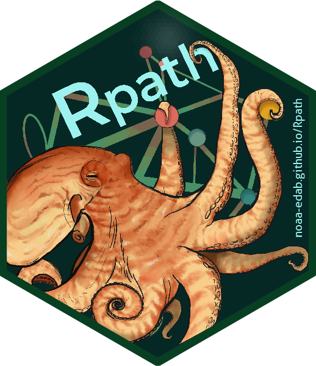

# Rpath  


<!-- badges: start -->
[](https://github.com/NOAA-EDAB/Rpath/actions/workflows/secretScan.yml)
[](https://github.com/NOAA-EDAB/Rpath/actions/workflows/pkgdown.yaml)
[](https://github.com/NOAA-EDAB/Rpath/actions/workflows/R-CMD-check.yaml)
[](https://github.com/NOAA-EDAB/Rpath/actions/workflows/R-CMD-check.yaml)
<!-- [](https://github.com/NOAA-EDAB/Rpath/actions/workflows/tests.yml) -->
<!-- badges: end -->

Package _Rpath_ is an R implementation of the Ecopath (mass-balance) and Ecosim (dynamic simulation) methods for the modeling of food webs. The _Rpath_ package includes sensitivity analysis tools, bioenergetics forcing, and the ability to
develop adaptive dynamic simulations with annual adjustment/feedback for use
in management strategy evaluations and similar analyses.

## Installation

To install the package and build all of the vignettes locally

```
remotes::install_github("noaa-edab/Rpath",build_vignettes=TRUE)`
```

If you experience issues installing the package using `remotes` or don't need the vignettes locally then please use this alternative

```
pak::pak("noaa-edab/Rpath")
```

# More details

For more background, please see:

### For Rpath description and methods:
Sean M. Lucey, Sarah K. Gaichas, Kerim Y. Aydin,
Conducting reproducible ecosystem modeling using the open source mass balance model Rpath, Ecological Modelling, Volume 427, 2020, 109057, ISSN 0304-3800, https://doi.org/10.1016/j.ecolmodel.2020.109057.

### For use of Rpath for management strategy evaluations:
Sean M. Lucey, Sarah K. Gaichas, Kerim Y. Aydin,
Conducting reproducible ecosystem modeling using the open source mass balance model Rpath, Ecological Modelling, Volume 427, 2020, 109057, ISSN 0304-3800, https://doi.org/10.1016/j.ecolmodel.2020.109057.

### For incorporation of bioenergetics into simulations:
Sean M. Lucey, Sarah K. Gaichas, Kerim Y. Aydin,
Conducting reproducible ecosystem modeling using the open source mass balance model Rpath, Ecological Modelling, Volume 427, 2020, 109057, ISSN 0304-3800, https://doi.org/10.1016/j.ecolmodel.2020.109057

### For use of Rpath sensitivty tools:
George A. Whitehouse, Kerim Y. Aydin,
Assessing the sensitivity of three Alaska marine food webs to perturbations: an example of Ecosim simulations using Rpath, Ecological Modelling, Volume 429, 2020, 109074, ISSN 0304-3800, https://doi.org/10.1016/j.ecolmodel.2020.109074.

### For original development of Ecopath and Ecosim:
Polovina, J. J. (1984). Model of a coral reef ecosystem. Coral Reefs, 3(1), 1–11. https://doi.org/10.1007/BF00306135

Christensen, V., & Walters, C. J. (2004). Ecopath with Ecosim: Methods, capabilities and limitations. Ecological Modelling, 172(2), 109–139. https://doi.org/10.1016/j.ecolmodel.2003.09.003

Walters, C., Pauly, D., Christensen, V., & Kitchell, J. F. (2000). Representing Density Dependent Consequences of Life History Strategies in Aquatic Ecosystems: EcoSim II. Ecosystems, 3(1), 70–83. https://doi.org/10.1007/s100210000011

# Disclaimer

*This repository is a scientific product and is not official communication of the National Oceanic and Atmospheric Administration, or the United States Department of Commerce. All NOAA GitHub project code is provided on an ‘as is’ basis and the user assumes responsibility for its use. Any claims against the Department of Commerce or Department of Commerce bureaus stemming from the use of this GitHub project will be governed by all applicable Federal law. Any reference to specific commercial products, processes, or services by service mark, trademark, manufacturer, or otherwise, does not constitute or imply their endorsement, recommendation or favoring by the Department of Commerce. The Department of Commerce seal and logo, or the seal and logo of a DOC bureau, shall not be used in any manner to imply endorsement of any commercial product or activity by DOC or the United States Government.*


[U.S. Department of Commerce](https://www.commerce.gov/) | [National Oceanographic and Atmospheric Administration](https://www.noaa.gov) | [NOAA Fisheries](https://www.fisheries.noaa.gov/)
