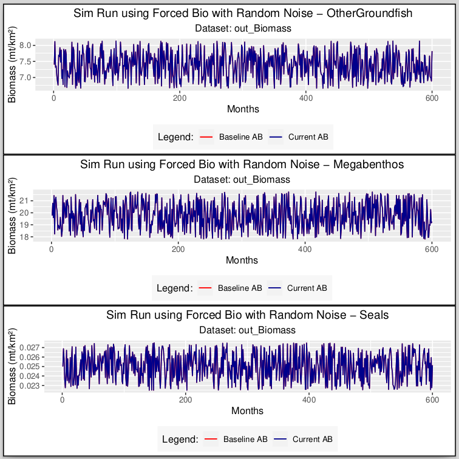
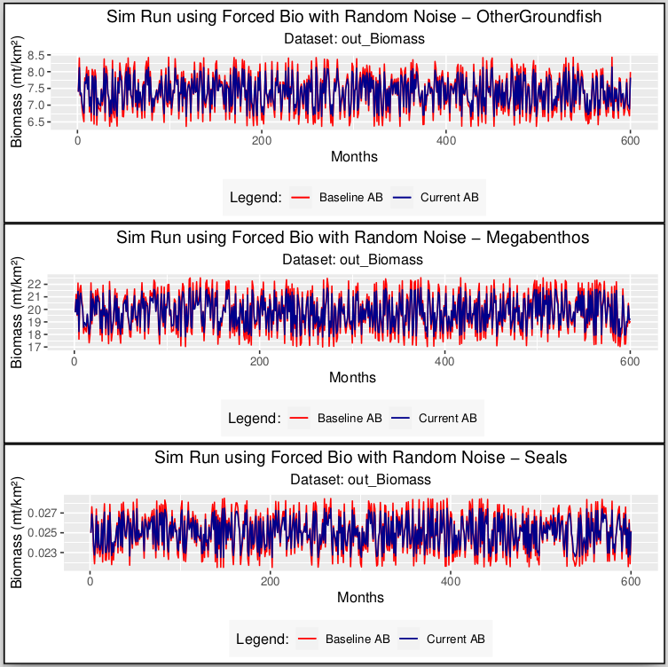
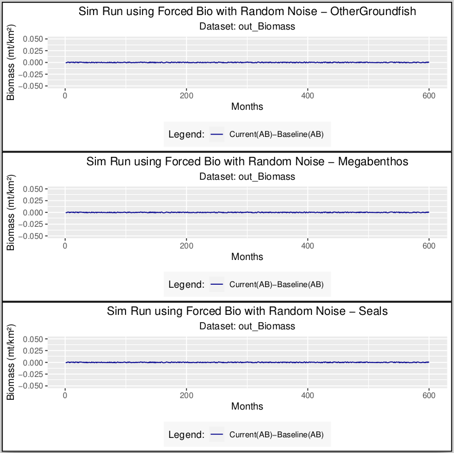

Source: ```vignettes/UnitTests.Rmd```
```{r setup, include = FALSE}
knitr::opts_chunk$set(
  collapse = TRUE,
  comment = "#>"
)
```

## Unit Tests

Unit Tests are written using the testthat R package. The tests are stored in the file: **tests/tests_rpath.R**. They may be run explicitly by the user clicking the Test or Check buttons under the Build tab in RStudio. They also run automatically via git actions when the user does a push or pull request. The output of the unit tests is a pdf file with a variety of comparison plots, examples of which are given below in Figures 1-3.

## Details

Unit Tests consist of comparing a "current" model value (i.e., string, table) to a previously stored "baseline" value. Differences are shown in the testing output as well as reflected in the generated plots which are written to: **Rplots.pdf**. Difference "tolerances" are defined by the variable:

```{r Tolerance}
TOLERANCE <- 1e-5
```

which can be modified as necessary.

### Regenerating Baseline Files

If the user needs to regenerate the baseline files, the following variable should be set to TRUE and the tests re-run manually (by clicking the Test button under the Build tab). This will regenerate all of the baseline data files.

```{r Create Baseline 1}
CREATE_BASELINE_FILES <- TRUE
```

After the baseline files have been generated, the user should reset the variable back:

```{r Create Baseline 2}
CREATE_BASELINE_FILES <- FALSE
```

## List of Tests

The following unit tests have been developed. Note that some tests consist of additional/finer tests that compare out_Biomass, out_Catch, and out_Gear_Catch* for AB (Adams-Bashforth) and RK4 (4th Order Runge Kutta) numerical differential equation methods.

### Unit Tests

<details><summary>Is model balanced?</summary>
1. Looks for "Balanced" string in Rpath summary file output
</details>

<details><summary>Does model run silent?</summary>
2. Tests if model runs without producing print statements, warnings, or error messages.
</details>

<details><summary>Compare Rpath summaries</summary>
3. Is the baseline Rpath object the same as the current Rpath object?
</details>

<details><summary>Compare Rpath summaries</summary>
4. Is the baseline Rpath summary the same as the current Rpath summary?
</details>

<details><summary>Compare baseline AB sim run to current AB sim run</summary>
5. Checks if baseline Rpath AB sim run is same as current AB sim run (checks top level data structure only)<br>
6. Compare out_Biomass from baseline and current AB sim runs<br>
7. Compare out_Catch from baseline and current AB sim runs<br>
8. Compare out_Gear_Catch from baseline and current AB sim runs<br>
</details>

<details><summary>Compare baseline RK4 sim run to current RK4 sim run</summary>
9. Checks if baseline RK4 sim run same as current RK4 sim run (checks top level data structure only)<br>
10. Compare out_Biomass from baseline and current RK4 sim runs<br>
11. Compare out_Catch from baseline and current RK4 sim runs<br>
12. Compare out_Gear_Catch from baseline and current RK4 sim runs<br>
</details>

<details><summary>Compare baseline AB sim run to current RK4 sim run</summary>
13. Checks if baseline AB sim run same as current RK4 sim run (checks top level data structure only)<br>
14. Compare out_Biomass from baseline AB run and current RK4 sim run<br>
15. Compare out_Catch from baseline AB run and current RK4 sim run<br>
16. Compare out_Gear_Catch from baseline AB run and current RK4 sim run<br>
</details>

<details><summary>Compare sim runs with random noise (i.e., jitter) added to \$forcing\$ForcedBio</summary>
17. Compare out_Biomass from baseline AB run and current AB run with noise added to ForcedBio<br>
18. Compare out_Catch from baseline AB run and current AB run with noise added to ForcedBio<br>
19. Compare out_Gear_Catch from baseline AB run and current AB run with noise added to ForcedBio<br>
20. Compare out_Biomass from baseline RK4 run and current RK4 run with noise added to ForcedBio<br>
21. Compare out_Catch from baseline RK4 run and current RK4 run with noise added to ForcedBio<br>
22. Compare out_Gear_Catch from baseline RK4 run and current RK4 run with noise added to ForcedBio<br>
</details>

<details><summary>Compare sim runs with random noise (i.e., jitter) added to \$forcing\$ForcedMigrate</summary>
23. Compare out_Biomass from baseline AB run and current AB run with noise added to ForcedMigrate<br>
24. Compare out_Catch from baseline AB run and current AB run with noise added to ForcedMigrate<br>
25. Compare out_Gear_Catch from baseline AB run and current AB run with noise added to ForcedMigrate<br>
26. Compare out_Biomass from baseline RK4 run and current RK4 run with noise added to ForcedMigrate<br>
27. Compare out_Catch from baseline RK4 run and current RK4 run with noise added to ForcedMigrate<br>
28. Compare out_Gear_Catch from baseline RK4 run and current RK4 run with noise added to ForcedMigrate<br>
</details>

<details><summary>Compare sim runs with stepped noise added to \$forcing\$ForcedBio</summary>
29. Compare out_Biomass from baseline AB run and current AB run with stepped noise added to ForcedBio<br>
30. Compare out_Catch from baseline AB run and current AB run with stepped noise added to ForcedBio<br>
31. Compare out_Gear_Catch from baseline AB run and current AB run with stepped noise added to ForcedBio<br>
32. Compare out_Biomass from baseline RK4 run and current RK4 run with stepped noise added to ForcedBio<br>
33. Compare out_Catch from baseline RK4 run and current RK4 run with stepped noise added to ForcedBio<br>
34. Compare out_Gear_Catch from baseline RK4 run and current RK4 run with stepped noise added to ForcedBio<br>
</details>

<details><summary>Compare sim runs with stepped noise added to \$forcing\$ForcedMigrate</summary>
35. Compare out_Biomass from baseline AB run and current AB run with stepped noise added to ForcedMigrate<br>
36. Compare out_Catch from baseline AB run and current AB run with stepped noise added to ForcedMigrate<br>
37. Compare out_Gear_Catch from baseline AB run and current AB run with stepped noise added to ForcedMigrate<br>
38. Compare out_Biomass from baseline RK4 run and current RK4 run with stepped noise added to ForcedMigrate<br>
39. Compare out_Catch from baseline RK4 run and current RK4 run with stepped noise added to ForcedMigrate<br>
40. Compare out_Gear_Catch from baseline RK4 run and current RK4 run with stepped noise added to ForcedMigrate<br>
</details>

<details><summary>Compare sim runs with random noise (i.e., jitter) added to \$fishing\$ForcedEffort</summary>
41. Compare out_Biomass from baseline AB run and current AB run with noise added to ForcedEffort<br>
42. Compare out_Catch from baseline AB run and current AB run with noise added to ForcedEffort<br>
43. Compare out_Gear_Catch from baseline AB run and current AB run with noise added to ForcedEffort<br>
44. Compare out_Biomass from baseline RK4 run and current RK4 run with noise added to ForcedEffort<br>
45. Compare out_Catch from baseline RK4 run and current RK4 run with noise added to ForcedEffort<br>
46. Compare out_Gear_Catch from baseline RK4 run and current RK4 run with noise added to ForcedEffort<br>
</details>

<details><summary>Compare sim runs with random noise (i.e., jitter) added to \$fishing\$ForcedFRate</summary>
47. Compare out_Biomass from baseline AB run and current AB run with noise added to ForcedFRate<br>
48. Compare out_Catch from baseline AB run and current AB run with noise added to ForcedFRate<br>
49. Compare out_Gear_Catch from baseline AB run and current AB run with noise added to ForcedFRate<br>
50. Compare out_Biomass from baseline RK4 run and current RK4 run with noise added to ForcedFRate<br>
51. Compare out_Catch from baseline RK4 run and current RK4 run with noise added to ForcedFRate<br>
52. Compare out_Gear_Catch from baseline RK4 run and current RK4 run with noise added to ForcedFRate<br>
</details>

<details><summary>Compare sim runs with random noise (i.e., jitter) added to \$fishing\$ForcedCatch</summary>
53. Compare out_Biomass from baseline AB run and current AB run with noise added to ForcedCatch<br>
54. Compare out_Catch from baseline AB run and current AB run with noise added to ForcedCatch<br>
55. Compare out_Gear_Catch from baseline AB run and current AB run with noise added to ForcedCatch<br>
56. Compare out_Biomass from baseline RK4 run and current RK4 run with noise added to ForcedCatch<br>
57. Compare out_Catch from baseline RK4 run and current RK4 run with noise added to ForcedCatch<br>
58. Compare out_Gear_Catch from baseline RK4 run and current RK4 run with noise added to ForcedCatch<br>
</details>

<details><summary>Compare sim runs with stepped noise added to \$fishing\$ForcedEffort</summary>
59. Compare out_Biomass from baseline AB run and current AB run with stepped noise added to ForcedEffort<br>
60. Compare out_Catch from baseline AB run and current AB run with stepped noise added to ForcedEffort<br>
61. Compare out_Gear_Catch from baseline AB run and current AB run with stepped noise added to ForcedEffort<br>
62. Compare out_Biomass from baseline RK4 run and current RK4 run with stepped noise added to ForcedEffort<br>
63. Compare out_Catch from baseline RK4 run and current RK4 run with stepped noise added to ForcedEffort<br>
64. Compare out_Gear_Catch from baseline RK4 run and current RK4 run with stepped noise added to ForcedEffort<br>
</details>

<details><summary>Compare sim runs with stepped noise added to \$fishing\$ForcedFRate</summary>
65. Compare out_Biomass from baseline AB run and current AB run with stepped noise added to ForcedFRate<br>
66. Compare out_Catch from baseline AB run and current AB run with stepped noise added to ForcedFRate<br>
67. Compare out_Gear_Catch from baseline AB run and current AB run with stepped noise added to ForcedFRate<br>
68. Compare out_Biomass from baseline RK4 run and current RK4 run with stepped noise added to ForcedFRate<br>
69. Compare out_Catch from baseline RK4 run and current RK4 run with stepped noise added to ForcedFRate<br>
70. Compare out_Gear_Catch from baseline RK4 run and current RK4 run with stepped noise added to ForcedFRate<br>
</details>

<details><summary>Compare sim runs with stepped noise added to \$fishing\$ForcedCatch</summary>
71. Compare out_Biomass from baseline AB run and current AB run with stepped noise added to ForcedCatch<br>
72. Compare out_Catch from baseline AB run and current AB run with stepped noise added to ForcedCatch<br>
73. Compare out_Gear_Catch from baseline AB run and current AB run with stepped noise added to ForcedCatch<br>
74. Compare out_Biomass from baseline RK4 run and current RK4 run with stepped noise added to ForcedCatch<br>
75. Compare out_Catch from baseline RK4 run and current RK4 run with stepped noise added to ForcedCatch<br>
76. Compare out_Gear_Catch from baseline RK4 run and current RK4 run with stepped noise added to ForcedCatch<br>
</details>
<br>
*The out_Gear_Catch tests are currently awaiting issue #74 to be resolved.

## Figures

The Unit Tests compare current runs with baseline runs and produce plots in a pdf file. These plots may be useful for diagnostic purposes. The plots depict the output of a current run in blue and of the baseline run in red. If there are no errors, then there should be no red visible on the plots. There are two types of plots available, also set by a variable in tests/tests_rpath.R:

```{r Plot Type 1}
PLOT_TYPE <- 1 
```

If PLOT_TYPE is set to 1, then the plot depicts the current model in blue superimposed over the baseline model in red. If PLOT_TYPE is set to 2, then the difference (current-baseline) is displayed.

## Example plots:

Figure 1 depicts an Rpath Simulation run of Biomass Density vs Time for 3 species. The ```REcosystem_scene$forcing$ForcedBio``` table, where

``` {r ForcedBio, eval=FALSE}
  REcosystem_scene <- rsim.scenario(REco, REco.params, 1:50)
```

has been modified with random noise. Both the baseline and current model runs use the AB (Adams-Bashforth) numerical differential equation method. Notice that there is no red line visible in this plot. That is, the current (blue) line is identical (and covers completely) the baseline (red) plot.
<br><br>

```{r figs1, echo=FALSE, out.width="85%:", out.height="85%", fig.cap="Figure 1. No Difference in Baseline vs Current Models"}
print(paste0("*** working dir: ", getwd()))

```
<br><br>
Figure 2 depicts the same information as Figure 1 with the difference being that the randomization factor was slightly changed in the current model from what was used in the baseline model. This was done to only to highlight how the plot would appear if the current model deviated from the baseline. Notice that the underlying baseline plot (in red) is now clearly visible.
<br><br>
```{r figs2, echo=FALSE, out.width="85%:", out.height="85%", fig.cap="Figure 2. Difference in red of Baseline vs Current Models"}

```
<br><br>
Figure 3 shows the difference of the current and baseline models. If the models were identical, the difference would be 0, and the plots should be completely flat lines. This plot shows the current-baseline plots for the data shown in Figure 2. Notice that the plot lines are not completely flat, denoting that the difference is not 0. The scale of the y-axis may be modified by changing the following line in **tests/tests_rpath.R**:

``` {r scale}
YLIMIT_DIFFERENCE_PLOTS <- 0.05
```
```{r figs3, echo=FALSE, out.width="85%:", out.height="85%", fig.cap="Figure 3. Current-Baseline Result"}

```
